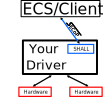

=====
SHALL
=====

SHALL is a C/C++ library, which can be called from high-level programming languages
with a C-compatible interface.

Using calls to the libraries functions, a the nodes modules and their parameters
are defined.
Afterwards, updates to the values can be supplied with other calls to the library.

As an example, this makes it possible to add SECoP-capabilities to existing LabView
programs by making calls to the dll.

Sources/Where to get
--------------------

`On GitHub <https://github.com/SampleEnvironment/SHALL>`_.
